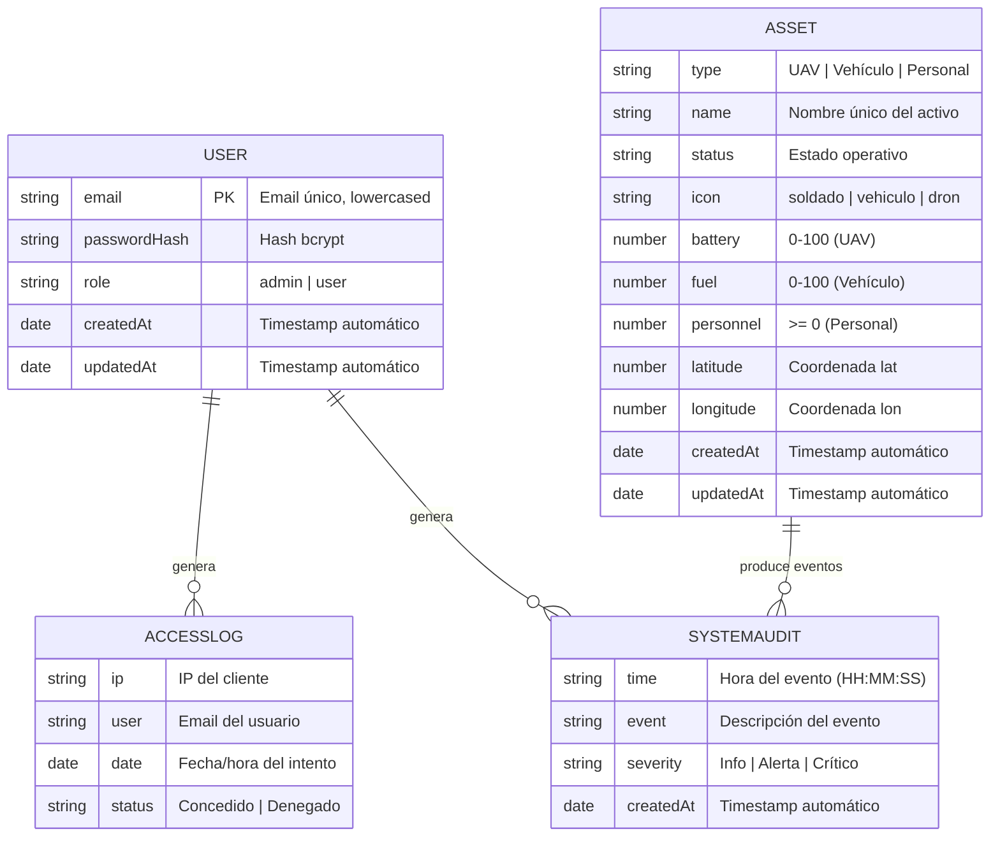
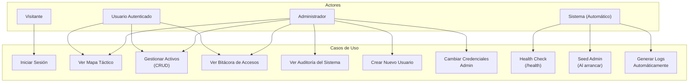
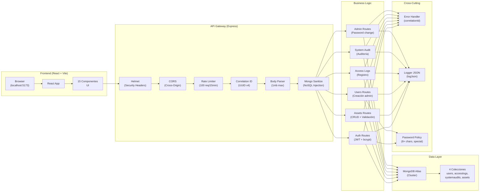
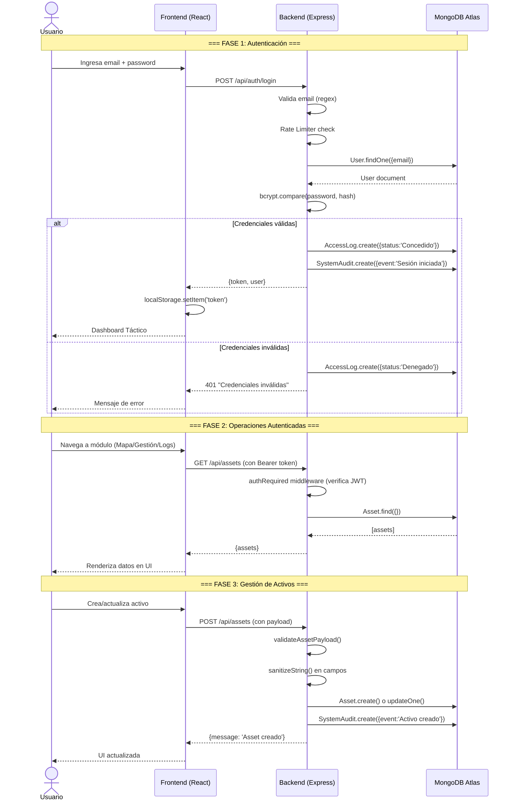
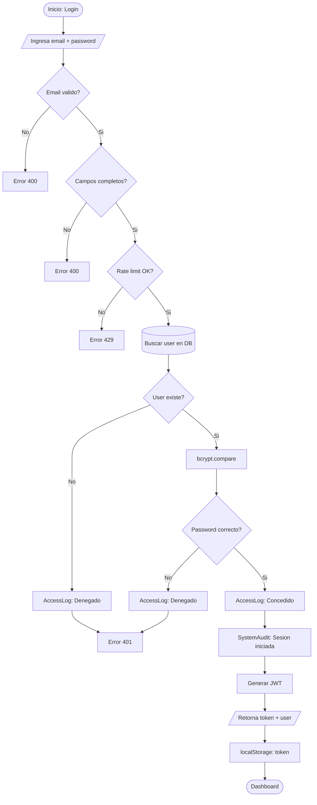
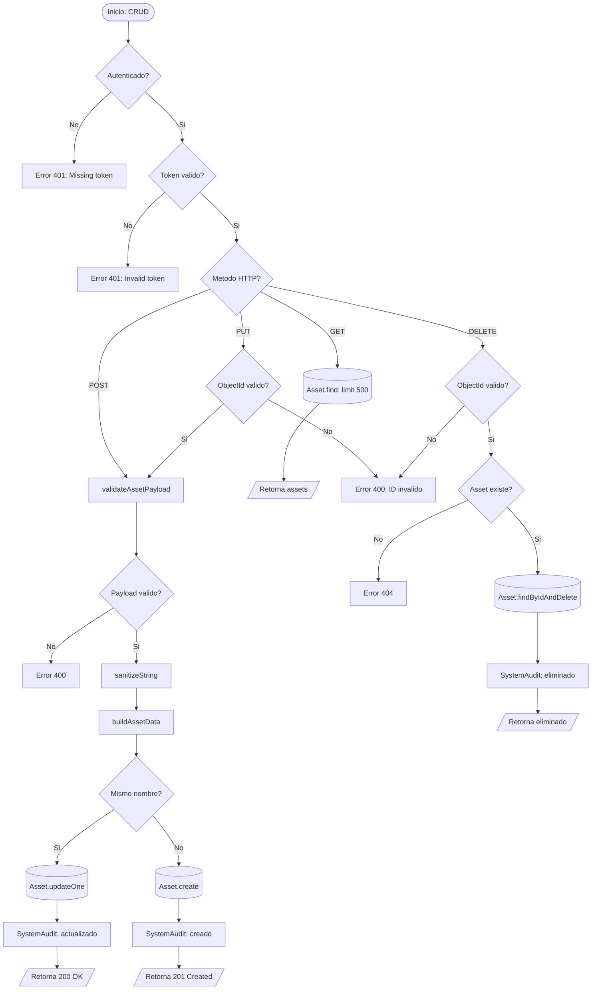

# Tactical Control Dashboard

Dashboard web (React + Vite + Tailwind) con backend Node.js + Express + MongoDB.

---

## Modelado de Base de Datos

### Diagrama Entidad-Relación



### Diccionario de Datos

#### Colección `users`

| Campo | Tipo | Restricciones | Descripción |
|-------|------|---------------|-------------|
| `_id` | ObjectId | PK, automático | Identificador único del documento |
| `email` | String | `required`, `unique`, `lowercase`, `trim` | Email institucional del usuario |
| `passwordHash` | String | `required` | Contraseña hasheada con bcrypt (10 rounds) |
| `role` | String | `enum: ['admin', 'user']`, default `'user'` | Rol del usuario en el sistema |
| `createdAt` | Date | Automático (`timestamps: true`) | Fecha de creación del registro |
| `updatedAt` | Date | Automático (`timestamps: true`) | Fecha de última actualización |

#### Colección `accesslogs`

| Campo | Tipo | Restricciones | Descripción |
|-------|------|---------------|-------------|
| `_id` | ObjectId | PK, automático | Identificador único del documento |
| `ip` | String | Default `''` | Dirección IP del cliente que intentó acceder |
| `user` | String | `required` | Email del usuario que intentó acceder |
| `date` | Date | Default `new Date()` | Fecha y hora del intento de acceso |
| `status` | String | `enum: ['Concedido', 'Denegado']` | Resultado del intento de login |

#### Colección `systemaudits`

| Campo | Tipo | Restricciones | Descripción |
|-------|------|---------------|-------------|
| `_id` | ObjectId | PK, automático | Identificador único del documento |
| `time` | String | `required` | Hora del evento en formato `HH:MM:SS` |
| `event` | String | `required` | Descripción textual del evento registrado |
| `severity` | String | `enum: ['Info', 'Alerta', 'Crítico']`, default `'Info'` | Nivel de severidad del evento |
| `createdAt` | Date | Automático (`timestamps: true`) | Fecha de creación del registro |

#### Colección `assets`

| Campo | Tipo | Restricciones | Descripción |
|-------|------|---------------|-------------|
| `_id` | ObjectId | PK, automático | Identificador único del documento |
| `type` | String | `required` | Tipo de activo: `UAV`, `Vehículo` o `Personal` |
| `name` | String | `required`, `unique` | Nombre único del activo táctico |
| `status` | String | `required` | Estado operativo del activo |
| `icon` | String | `enum: ['soldado', 'vehiculo', 'dron']`, default `'soldado'` | Icono para representación en mapa |
| `battery` | Number | `min: 0`, `max: 100`, default `null` | Nivel de batería (solo UAV) |
| `fuel` | Number | `min: 0`, `max: 100`, default `null` | Nivel de combustible (solo Vehículos) |
| `personnel` | Number | `min: 0`, default `null` | Cantidad de personal (solo Personal) |
| `latitude` | Number | `required` | Coordenada de latitud |
| `longitude` | Number | `required` | Coordenada de longitud |
| `createdAt` | Date | Automático (`timestamps: true`) | Fecha de creación del registro |
| `updatedAt` | Date | Automático (`timestamps: true`) | Fecha de última actualización |

---

## Diagramas UML

### Diagrama de Caso de Uso



### Diagrama de Arquitectura



### Diagrama de Secuencia — Flujo General del Sistema



### Diagrama de Flujo — Proceso Critico 1: Autenticacion



### Diagrama de Flujo — Proceso Critico 2: Gestion de Activos



---

## Estructura del repositorio
- `src/`: frontend React
- `backend/`: backend Express con MongoDB Atlas

## Requisitos
- Node.js (recomendado LTS)
- MongoDB Atlas o una base de datos MongoDB accesible

## Configuración
1. En la raíz del proyecto:
   ```bash
   npm install
   ```
2. En el backend:
   ```bash
   cd backend
   npm install
   ```
3. Copia el archivo de ejemplo en el backend:
   ```bash
   cd backend
   copy .env.example .env
   ```
4. Configura en `backend/.env`:
   - `MONGODB_URI`
   - `JWT_SECRET`
   - `ADMIN_EMAIL`
   - `ADMIN_PASSWORD`
   - `CORS_ORIGINS`

5. Si necesitas cambiar el backend de desarrollo para el frontend, crea un archivo `.env` en la raíz con:
   ```bash
   VITE_API_URL=http://localhost:5000
   ```

## Ejecutar en desarrollo
1. Levanta el backend:
   ```bash
   cd backend
   npm run dev
   ```
2. Levanta el frontend desde la raíz:
   ```bash
   npm run dev
   ```

## Pruebas y documentación técnica
- `cd backend && npm test` — ejecuta la suite de pruebas unitarias del backend
- `cd backend && npm run docs` — genera la documentación técnica en `backend/docs`
- `npm run backend:test` — ejecuta los tests del backend desde la raíz
- `npm run backend:docs` — genera la documentación del backend desde la raíz

## Build de producción
```bash
npm run build
```

## Scripts útiles
- `npm run backend:install` — instala dependencias del backend
- `npm run backend:dev` — inicia el backend desde la raíz

## Comandos para evaluación (tests y documentación)

Sigue estos comandos para reproducir lo que se evaluará en el avance:

- Instalar dependencias del backend:

```bash
cd backend
npm install
```

- Ejecutar la suite de pruebas del backend:

```bash
cd backend
npm test
```

- Generar la documentación técnica autocontenida (JSDoc):

```bash
cd backend
npm run docs
# Abrir `backend/docs/index.html` en un navegador para ver la documentación
```

- Levantar el backend en desarrollo:

```bash
cd backend
npm run dev
```

El workflow de CI está en `.github/workflows/ci.yml` y ejecuta los tests del backend en cada `pull_request` y `push` a `main`.
- `npm run backend:test` — ejecuta pruebas del backend
- `npm run backend:docs` — genera documentación técnica del backend

## Qué ya está implementado
- Inicio de sesión real con JWT (`POST /api/auth/login`)
- Middleware de autenticación y autorización (`authRequired`, `requireAdmin`)
- Gestión de usuarios (`POST /api/users`)
- Bitácora de accesos (`GET /api/access-logs`)
- Auditoría de eventos (`GET /api/system-audit`)
- Gestión de activos (`GET /api/assets`, `POST /api/assets`)
- Cambio de contraseña administrativo (`PUT /api/admin/admin-password`)


## Nota de seguridad
No subas `.env` ni credenciales reales al repositorio. El archivo `.env` está excluido en `.gitignore`.
